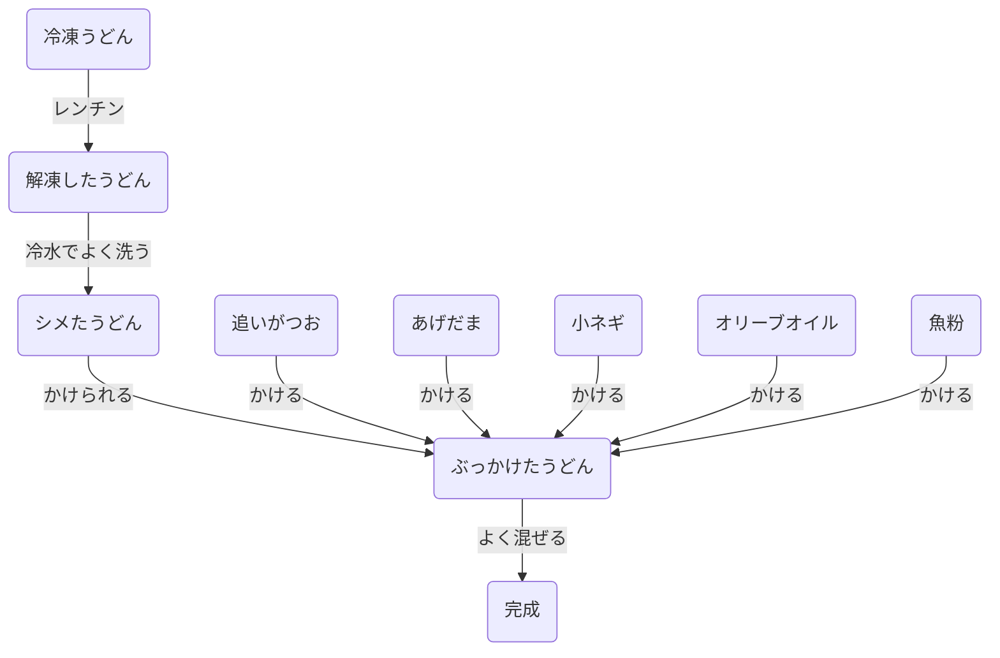
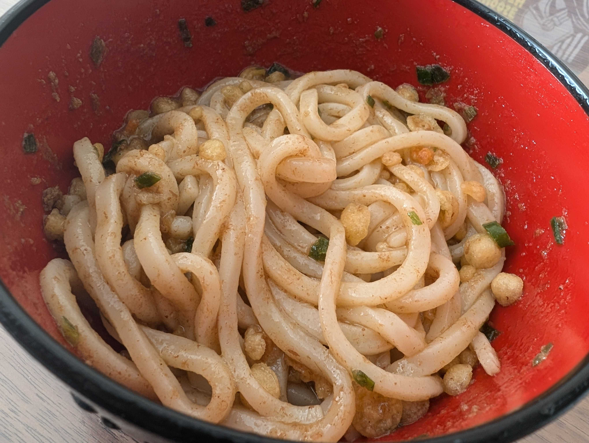

# ぶっかけまぜうどん

## 材料(1人分)
- 冷凍うどん: 1袋
  - [カトキチ(現:テーブルマーク)のやつ](https://www.tablemark.co.jp/products/frozen/udon/detail/7117278.html)しか認めんぞ
- めんつゆ: 適量
  - [追いがつお](https://www.mizkan.co.jp/tsuyu/oigatsuo/)しか認めんぞ
- オリーブオイル: 適量
  - できればBOSCOのエクストラヴァージン
- あげだま: 適量
  - Tier1はシマダヤ，次点スター食品とライフのプライベートブランド.セブンは冷やしに向かない．
- 小ネギ: 適量
- 魚粉（鰹粉末）: 適量・多い方がうまい

## 手順

## メモ
- うどんはカトキチがマスト．N清とかは麺が団子っぽいので好みでない．
  - カトキチがなかったら冷凍うどんは普及しなかったので足を向けて寝られない
- しっかり水で洗いながらシメましょう．麺類はたっぷりのお湯で茹でて(今回はレンチンだけど)しっかりぬめりを取るのが鉄則です．
- めんつゆは昆布つゆとかでも良いが，追いがつおが自宅でぶっかけ作るときは美味しいと思う
- あげだまは硬め食感のものがザクザクしてよい．セブンはすぐふやける＆卵いりなので味がぼやける
- 魚粉は乾物屋とかに行けば買えます．おすすめは川越の轟屋．つよい出汁パックとかあるので便利

## 図
