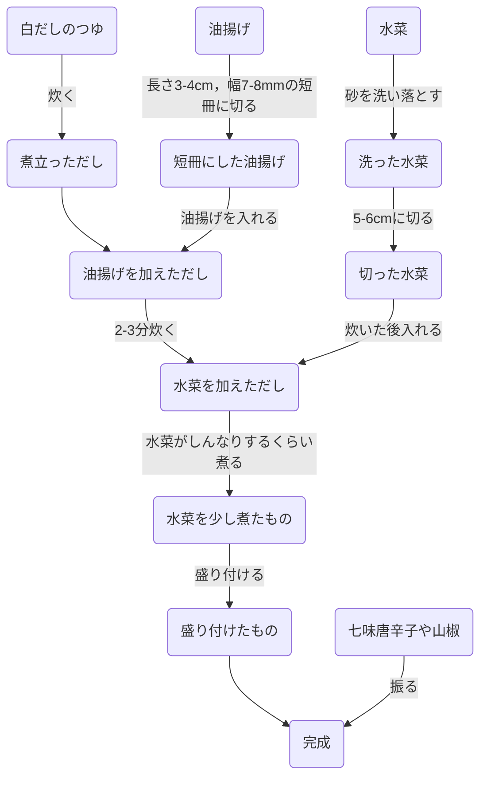
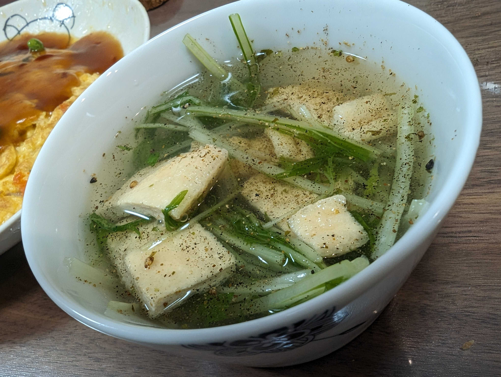

# 水菜の揚げのおひたし

## 材料(2人分)
- 水菜: 1/2束
- 油揚げ: 2枚
- 七味唐辛子や山椒: 適量
  - おすすめは[七味家](https://www.shichimiya.co.jp/SHOP/A0110.html)か[黒七味](https://shop.hararyoukaku.co.jp/i/040)
- 白だしのつゆ: 希釈して360ml分

## 手順

## メモ
- 汁多めにしておくと後で飲んだり麺類のおだしにできて便利
- 温かいままでも良いが，夏は冷やしてさっぱりさせるのもおすすめ

## 図
