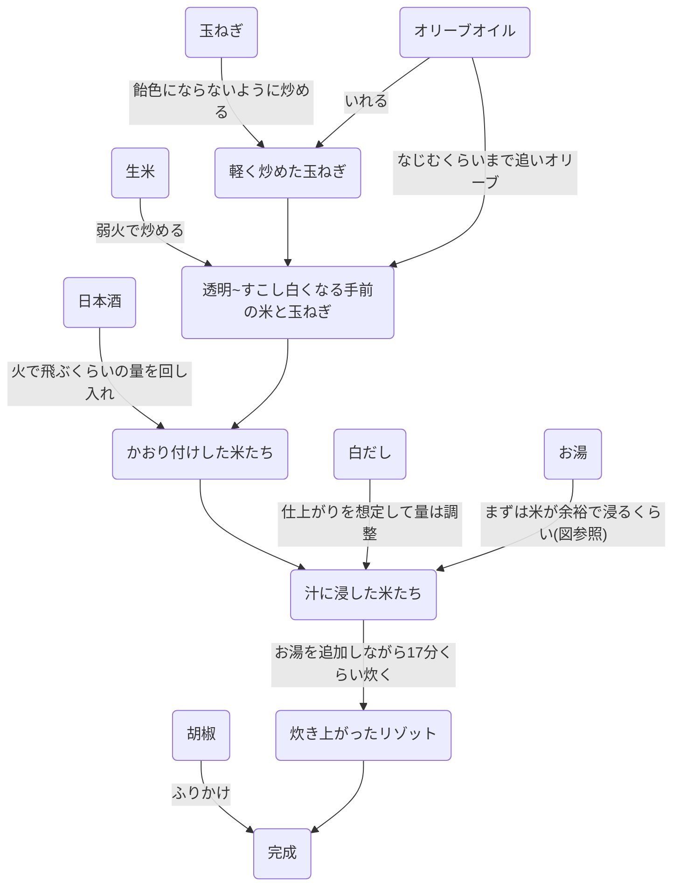
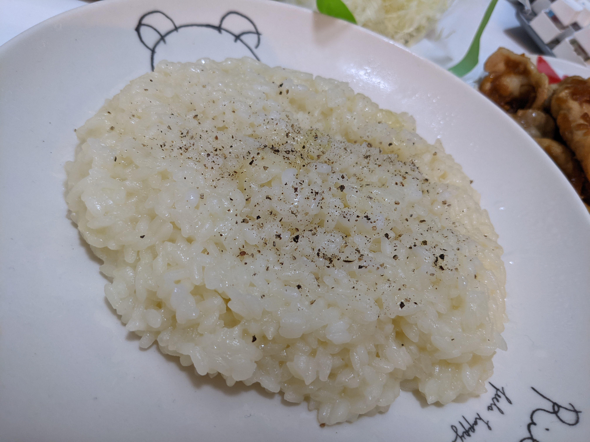
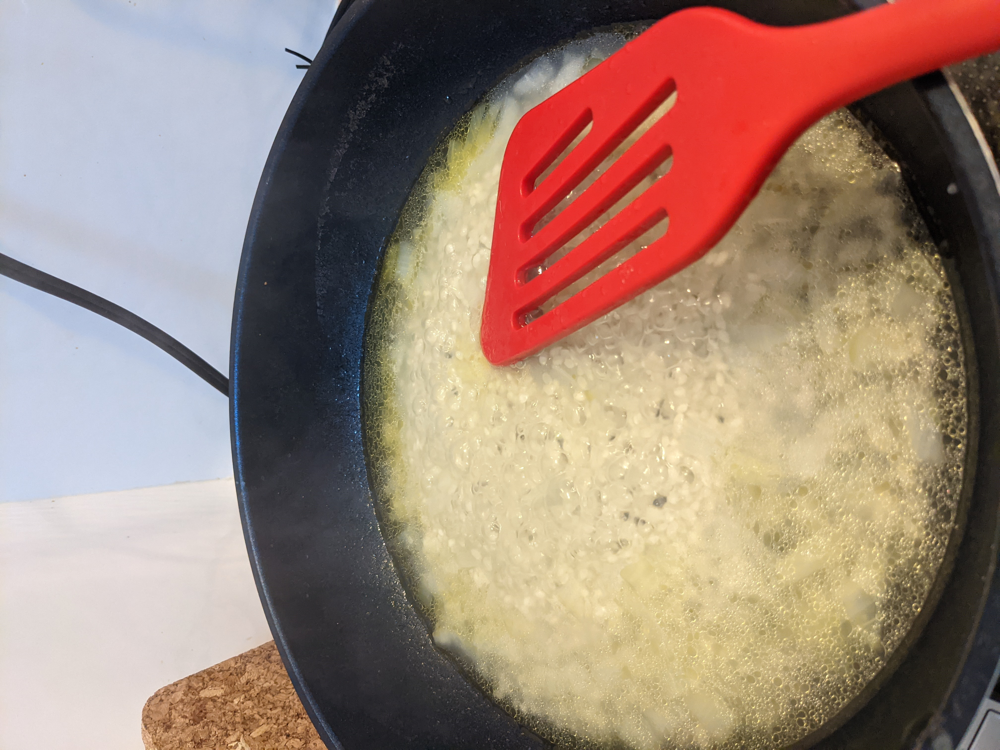

# リゾット

> 残せし飯より造られしものを、リゾットと呼ぶなかれ。  
> 初めより米を炊きて成るもの、これぞ真のリゾットなり。  
> — 『炊事録』9章2節

ベースにしたレシピはweb記事(消失)とめしにしましょうからで，これらからshisoがすべてのフレーバーに応用できる手順としてプチ改造した。

## 材料(1人分)
- 生米: 0.8合
  - 案外お腹に溜まるのでほどほどにしよう
  - あとは炊く鍋やフライパンの容量と相談
- 玉ねぎ: 半分くらい
  - 色味を考えると生の玉ねぎを使う
  - 後述の混ぜ物やショートカットをする場合はフライドオニオンでもいける
- 日本酒: 回しいれるくらい
  - 香り付け＆うまみ増強に使う
  - 正統派なら白ワインだが，うまみを入れる目的で日本酒にする
  - うまい日本酒を使った方が仕上がりもうまい（当然）
- 白だし: 適量
  - うまみ兼塩味をつける
  - ヤマキの液体のやつがカツオベースでうまい
- オリーブオイル: 適量
  - 玉ねぎ及び生米を炒るのにつかう
  - 気持ち多いくらいでちょうど良い
- お湯: 適量
  - 炊くのに使う
  - まずは1Lくらいをポットなどで別で沸かしておき，必要に応じて追加
- 胡椒: 適量
  - 味をシャープにするために最後ふりかける
  - 彩りのためにバジルやパセリでも良い

## 手順

## メモ

- 汁や具材を調整することで任意の味のリゾットが作れる
  - トマトを一緒に入れてトマリゾ
  - トマト&ツナでシチリアーノ風
  - 仕上げのタイミングでチーズをいれてチーズリゾ
  - ダシダでVR牛丼
- 米を炒る加減
  - 炒る前は不透明
  - 油をいれて少し火が通ると透明になってきて，もう少しやるとひび割れて白くなるのでそのギリギリを攻める感じにする
  - 火の通りと味の染み込み，舌触りに影響するので好みでカスタムする要素の1つ
- 炊きながらのお湯の追加
  - 正統派レシピだと別に炊いたスープを掛けながら炊くことになっている
  - だがそれだと味がどんどん濃くなるので，先に濃度を決めた上で水分だけを調整するスタイルにした
    - ワンパンで完結し，洗い物を減らせるのもポイント
  - 目安は17分だが，気候や火力，鍋によって炊く時間や水分の飛び方が異なるのでここも仕上がりの好みで調整する
    - 一度10分くらいでちょっと米を噛んでみて硬さから判断するのがおすすめ．そして15分くらいでまた様子見をする．
    - 最終的に水分をほぼ飛ばして纏まるくらいの水気になるのを目指していく

## 図

完成図

一通り入れて炊きはじめ
