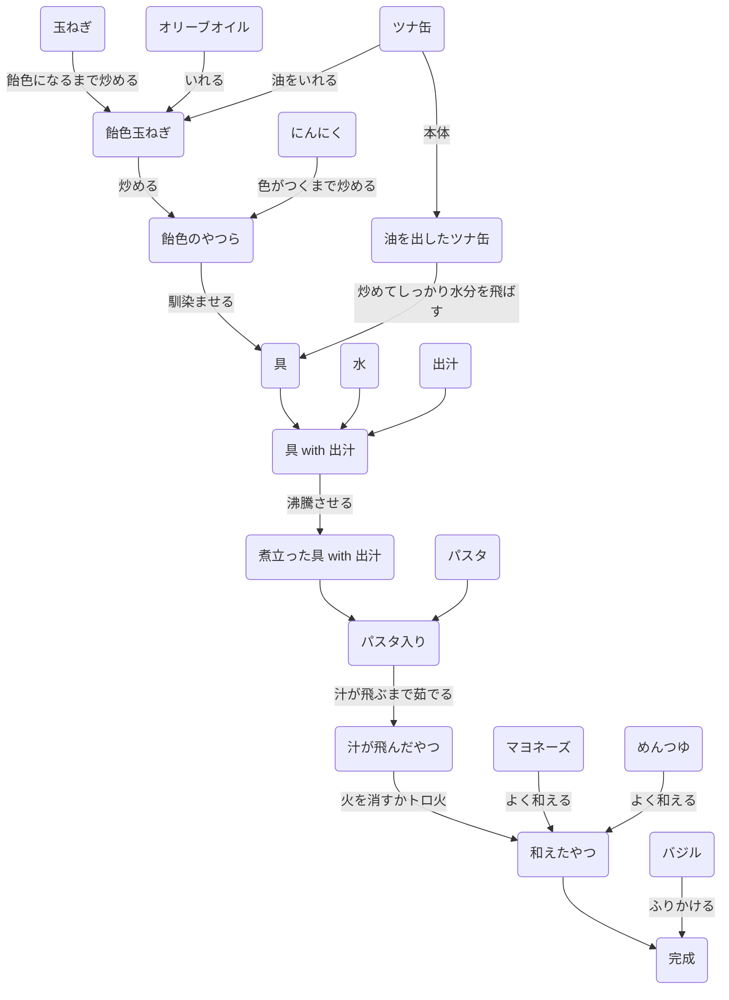

# 汁から茹でるツナパスタ

[ベースにしているレシピ: ワンパンだから麺も旨い！超濃厚な「極 ツナパスタ」の作り方 | フーディストノート](https://foodistnote.recipe-blog.jp/article/117418/)

## 材料(1人分)
- パスタ: 100gくらいが基本1人前らしい
  - [ディ・チェコのリングイネ](https://www.nisshin-seifun-welna.com/index/products/8001250002433.html)がおすすめ
- 玉ねぎ: 1/2個
  - フライドオニオンで代替すると飴色フェイズを飛ばせる
- にんにく: 刻んで適量
  - フライドガーリックで代替すると飴色フェイズを飛ばせる
- オリーブオイル: 適量
- ツナ缶: 1缶
  - 油はつかうので切らないでおく
- 出汁: 適量
  - 任意の出汁．昆布とかキノコの方が旨味相乗効果的に良いかも
  - 自分は白だしを適当に入れている
  - 煮詰める＆マヨめんつゆで味付けするので，濃さはやや薄めくらいでOK
- マヨネーズ: 適量
- めんつゆ: 適量
  - 先の出汁と同じく魚系でない方が旨味的には良いかも
  - 自分は追いがつおでやっている
- 水: 350ml~
  - 適宜蒸発や茹で具合をみて追加
- バジル: 適量
  - ギャバンとかの乾燥でよい

## 手順

## メモ
- 玉ねぎは飴色〜ちょい焦げくらいを狙ってやるのがベネ
- しっかり水分を飛ばした方が味がキマる

## 図
